DukeHub 3.0
================

## Introduction

DukeHub is the academic portal used by Duke students, faculty, and
advisers to register for courses, make tuition payments, and view
transcripts. Each semester, students spend much time crafting their
schedules to optimize campus experience. The current DukeHub 2.0 has a
“simple search” function to filter courses by term and subject area and
an “advanced class search” to filter by course attributes, meeting
times, instructor name, location, or the number of units. Although
DukeHub 2.0, launched in 2020, has improved user experience and added
more features compared to the previous version, our team would like to
add several features that make the course selection process more
convenient. Our DukeHub 3.0 is an R Shiny app that allows students to
build their academic schedule from 2408 courses/sections and provides
additional insights to their schedule through various visualizations.
Once a student inputs their schedule, the app will provide different
visualizations such as the enrollment caps, diversity of the subject
areas they study, and the expected traveling during a day based on the
classes student select.

## Interactive functions

We designed 6 tabs for students to explore the nitty-gritty of their
course schedules, which will be introduced in detail in the following
sections.

 \* [Schedule
builder](#schedule-builder)  
\* [Weekly calendar](#weekly-calendar)  
\* [Class information](#class-information)  
\* [Distance](#distance)  
\* [Course Catalog Info](#course-catalog-info)  
\* [Campus Map](#campus-map)  
\* [Conclusion](#conclusion)  
\* [Designing for accessibility](designing-for-accessibility)

### Schedule builder

Students can choose courses based on the specific subjects they would
like to take. Like the DukeHub 2.0, students can validate their schedule
to avoid time conflicts and overload limits (6 classes maximum), drop
classes back to the shopping cart, and clear all selections. If the
students didn’t choose any classes, the schedule builder will also
report invalid.

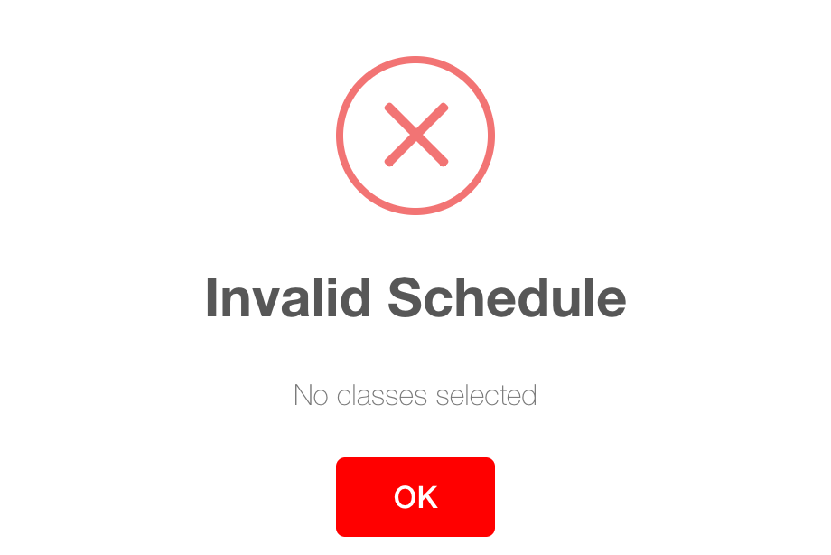

Our improvement from DukeHub 2.0 is that more information about classes
is available on the same page. Take an example of a student who wants to
choose African American Studies. In DukeHub 2.0, the dropdown list only
contains the course catalog numbers and descriptions after choosing the
subject.

Students need to click twice to see the time and location of a class,
which are difficult to find.

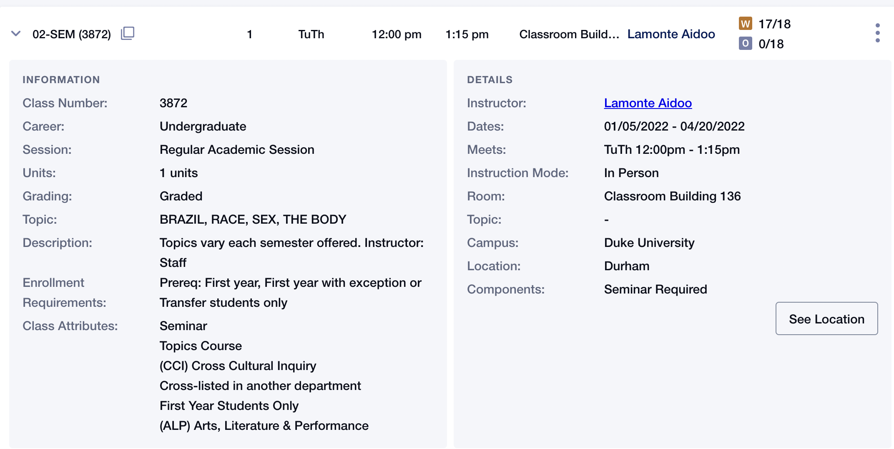

Our shiny app displays a comprehensive list of African American Studies
classes, including course catalog, description, enrollment cap,
location, time, teaching mode, etc. This will immediately give students
an idea of how far away this class is from their dorms, whether they
need to get up early to catch a bus, the class size, etc.

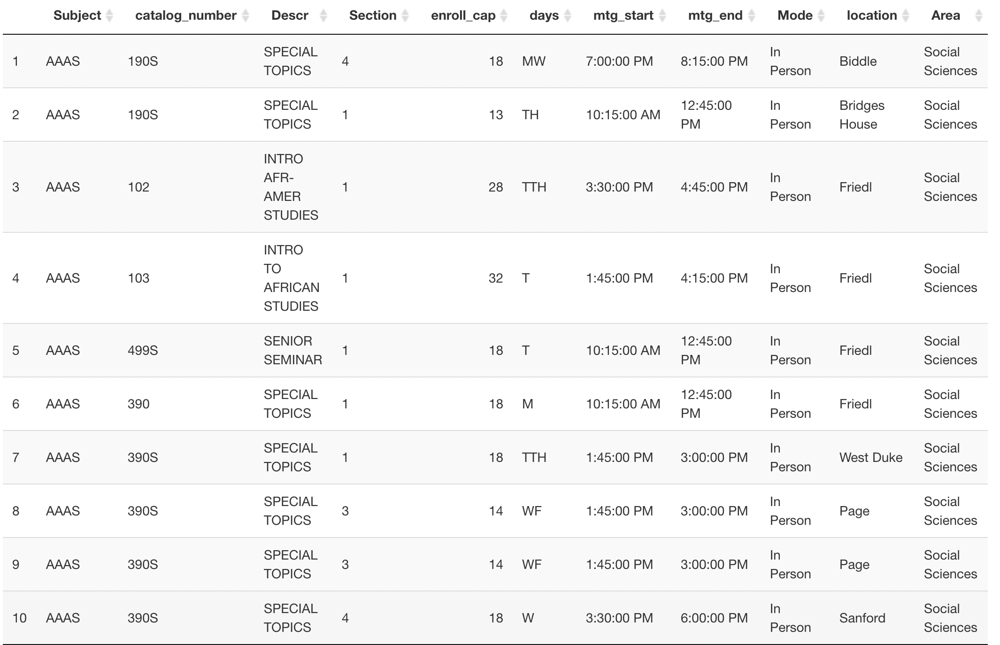

### Weekly calendar

The goal with the schedule and all the features we added is so that the
user can have a better experience with choosing their courses.

Once validated from the previous tab and step, the weekly calendar tab
plots the classes from Monday to Friday, 6AM - 10PM, colored by each
individual course. For accessibility, the classes show up in each proper
rectangle with the time interval of class start and ending time. This is
so that the user is able to get all of the information they truly need
without needing to look around the calendar too much.

The image below is a picture of a sample course schedule. The plot
covers Monday to Friday, even if there is no class on a certain day and
from 6AM to 10PM even if classes end earlier or later. As one can
notice, from the schedule, the smallest width rectangle is the
discussion for Hindi. This qualitatively confirms which class is shorter
in time and helps the reader have a more accurate understanding of their
courses without needing to refer to the reference course list below. To
separate the days, we added vertical lines. Also, each course is colored
differently. Even though both Hindi components are in the same
department and course number, they are still separate course components
and we wanted to reflect that. This comes in very handy when there is a
special topics class like AAAS 190S, where there are multiple unique
courses with the same Course Number, but different sections.

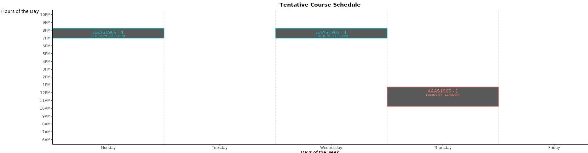

### Class information

The enrollment caps of the student’s classes are represented in a bar
chart colored by subject areas. General areas include “Arts &
Humanities”, “Natural Sciences”, “Social Sciences”, “Engineering”,
“Language”, “Physical Education”, and “Writing” according to Duke
academic curriculum. Students will be able to make choices conveniently
after visualizing the size of other classes. Subject areas are shown in
a pie chart to give the student an idea of how diverse their classes are
that semester.

Here is an example of a schedule of 6 classes. We see that COMPSCI 201
is a big introductory class with 300 enrollment cap, and the
higher-level AAAS 109S is smaller. Students might want to strike a
balance regarding class sizes to achieve a good learning experience.
Although there are 3 CS classes, this diverse schedule allows the
student to explore other areas like Engineering, Social Science, and
Arts & Humanities as well.

We hope these visualizations will help students determine on a schedule
with reasonable combination of classes sizes and subject areas and enjoy
the liberal arts education environment at Duke.

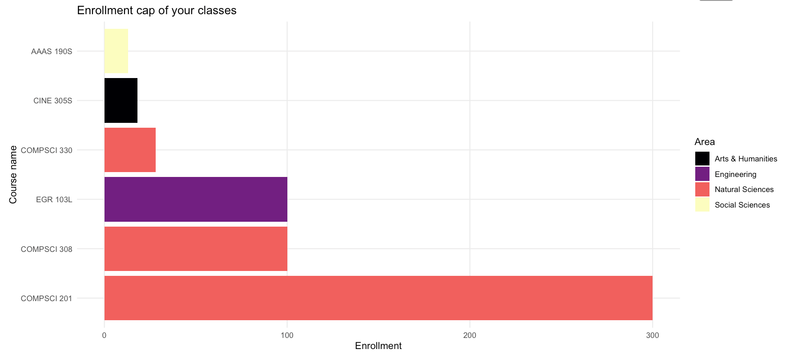

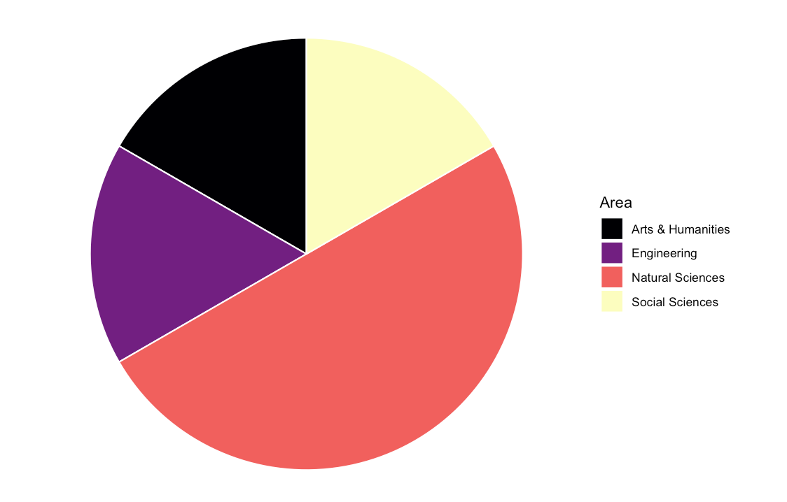

### Distance

After understanding about one’s schedule, the distance tab helps the
user have a better idea of how much walking they can expect in a day,
which is important when getting ready and deciding the attire that one
wants to present themselves in.

To calculate the cumulative distance, we assigned each location to a
certain group based on the nearby building. For instance, the gray
building, social sciences, and Rueben Cooke among others are assigned to
group 3. Based on the longitude and latitude of the midpoint of each
group, we were able to find the cumulative distance among each class for
the day.

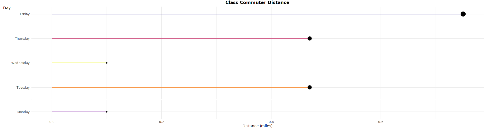

There are nuances to understand about this graph. For a day where there
is only a single class, the bar is very short, but still present. This
suggests that there should not be too much walking involved although it
is still possible. We specifically decided not to include distance from
the dorm because we can’t assume that students come from a specific Duke
dorm. Rather, they could live in an off-campus apartment or be coming
from a libary or the Brodhead center. For our graph, there is a
different color classification system as it is more important to color
the bars by day rather than individual course code or subject area.

### Course Catalog Info

The students are able to find higher-level information about all courses
during that semester. Duke campus is huge and hard to navigate, so we
want to show the students the location distribution of all classes. From
the donut chart, we find that the places where the most classes are held
are the main quad of West Campus (888 classes) and on Science Drive (535
classes).

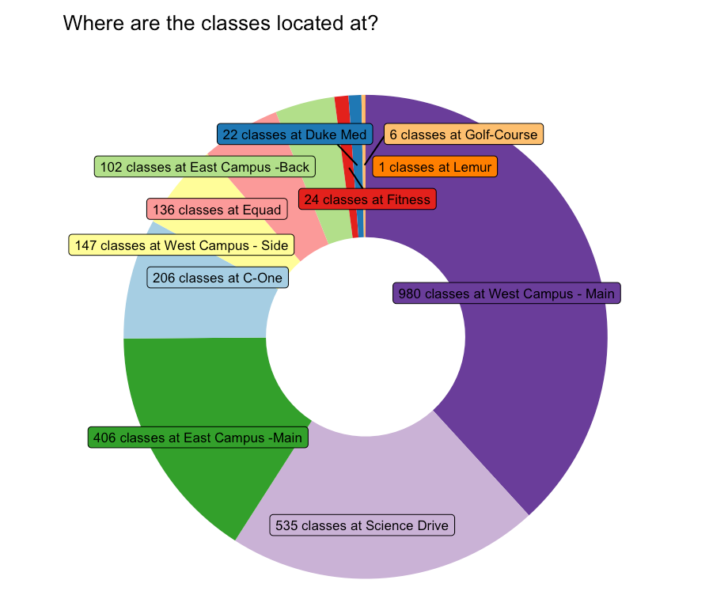

The specific course students choose indicate their interest in that
area, so it is also useful to know the distribution of locations by
these subject areas. The example schedule in [Class
information](#class-information) contains classes from four subject
areas. The lollipop plot indicates that Arts & Humanities classes are
mostly held on the main quad of West Campus as well as places between
East and West (C-One Route), such as Rubinstein Arts Center, Nasher
Museum of Art, and Smith Warehouse; Natural Sciences classes are mostly
held on Science Drive; and Social Sciences classes are spread on both
East and West campus.

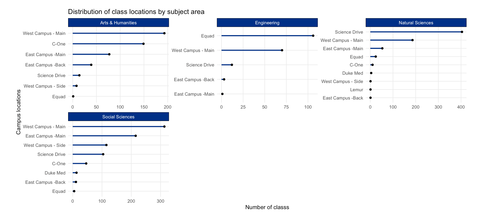

Another ranked lollipop chart shown below shows the 20 subjects that
have the most classes. If your schedule contains a subject that’s in
this list, it will be highlighted. Congrats! There are a lot of options
to choose from this subject you are interested in.

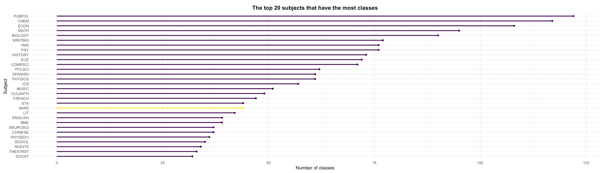

### Campus Map

A common issue faced by first-years, based on those we’ve surveyed was
the fact that it is time consuming to figure out where all of the
buildings are. Considering that’s 25% percent of our student body as
well as all of the first-year graduate students in all programs, that is
a very big issue that needs to be solved with a more accessible
solution. Even though DukeHub has a Duke Map available, one would need
to go to back to the login page and to the website to access their map.
To save time, we included it as a different tab.

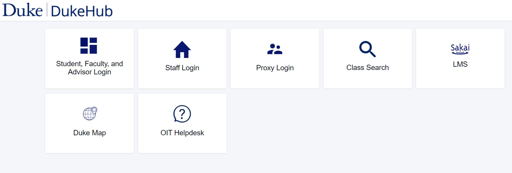 Furthermore on our Duke Map, we
added highlighter circles for different building groups like East
Campus-Main, Main Quad, Fitness, etc. Since this info was already given
in the previous tab, it makes it easier for the user to find the
relative group that their destination is in and scroll around there.

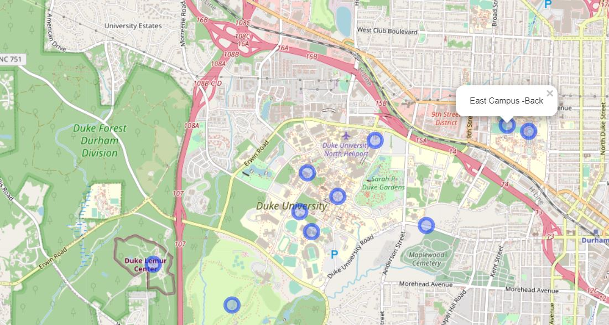

## Conclusion

Ultimately, our goal was to create a better DukeHub experience by
offering new visualizations that improve user experience. A key tenet
learned in the class on making good visualizations was the importance of
talking to users. Taking this to heart, every feature and visualization
we implemented was based on what others suggested Duke could have done
better.

## Designing for accessibility

With the goal of creating a better DukeHub experience, designing for
accessibility was even more crucial. To have a better understanding of
the comparisons between the actual Dukehub 3.0 and our own rshiny web
application, the alt text in the images of the write-up provided some
really important description and context. For our coloring scale, we
also used a colorblind friendly scale. We also used direct labeling for
as many visualizations as we could in order to make it faster to read.
We also used an accessibility tested font in Verdana.
