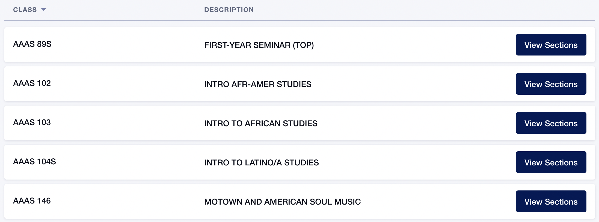
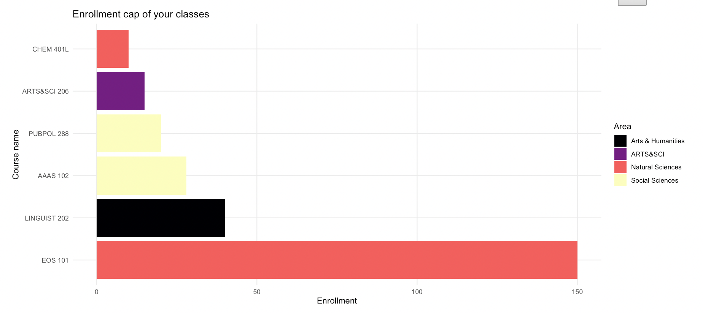
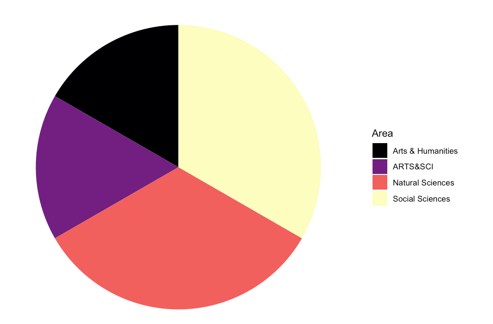

DukeHub 3.0
================

## Introduction

DukeHub is the academic portal used by Duke students, faculty, and
advisers to register for courses, make tuition payments, and view
transcripts. Each semester, students spend much time crafting their
schedules to optimize campus experience. The current DukeHub 2.0 has a
“simple search” function to filter courses by term and subject area and
an “advanced class search” to filter by course attributes, meeting
times, instructor name, location, or the number of units. Although
DukeHub 2.0, launched in 2020, has improved user experience and added
more features compared to the previous version, our team would like to
add several features that make the course selection process more
convenient. Our DukeHub 3.0 is an R Shiny app that allows students to
build their academic schedule from 2408 courses/sections and provides
additional insights to their schedule through various visualizations.
Once a student inputs their schedule, the app will provide different
visualizations such as the distance between the classes they choose to
avoid unnecessary travel in between classes. We will also make
recommendations on the good study spots based on the schedules users
create.

## Interactive functions

We designed 5 tabs for students to explore the details of their course
schedules.

### Schedule builder

Students can choose courses based on the specific subjects they would
like to take. Like the DukeHub 2.0, students can validate their schedule
to avoid time conflicts and overload limits, drop classes back to the
shopping cart, and clear all selections. One improvement from DukeHub
2.0 is that more information about classes is available on the same
page.

Take an example of a student who wants to choose African American
Studies. In DukeHub 2.0, the dropdown list only contains the course
catalog numbers and descriptions after choosing the subject.

Students need to click twice to see the time and location of a class,
which are difficult to find.

Our shiny app displasy a comprehensive list of African American Studies
classes, including course catalog, description, enrollment cap,
location, time, teaching mode, etc. This will immediately give students
an idea of how far away this class is from their dorms, whether they
need to get up early to catch a bus, the class size, etc.

### Weekly calendar

The courses selected in the previous step will show up in a daily
calendar format, colored by their patterns (WF, TTh, MWF, etc).

### Class information

The enrollment caps of the student’s classes are represented in a bar
chart colored by subject areas. General areas include “Arts &
Humanities”, “Natural Sciences”, “Social Sciences”, “Engineering”,
“Language”, “Physical Education”, and “Writing” according to Duke
academic curriculum. Students will be able to make choices conveniently
after visualizing the size of other classes. Subject areas are shown in
a pie chart to give the student an idea of how diverse their classes are
that semester.

Here is an example of a schedule of 6 classes:

 

### Distance

### Recommendations

## Conclusion
