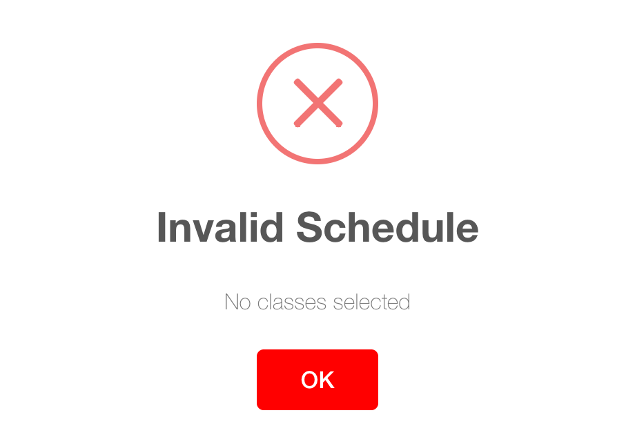
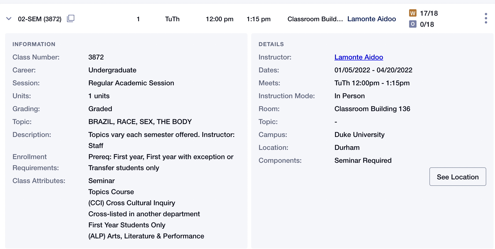

## Introduction

DukeHub is the academic portal used by Duke students, faculty, and advisers to register for courses, make tuition payments, and view transcripts. Each semester, students spend much time crafting their schedules to optimize campus experience. The current DukeHub 2.0 has a “simple search” function to filter courses by term and subject area and an “advanced class search” to filter by course attributes, meeting times, instructor name, location, or the number of units. Although DukeHub 2.0, launched in 2020, has improved user experience and added more features compared to the previous version, our team would like to add several features that make the course selection process more convenient. Our DukeHub 3.0 is an R Shiny app that allows students to build their academic schedule from 2408 courses/sections and provides additional insights to their schedule through various visualizations. Once a student inputs their schedule, the app will provide different visualizations such as the enrollment caps, diversity of the subject areas they study, and the expected traveling during a day based on the classes student select.\n

## Interactive functions
We designed 5 tabs for students to explore the nitty-gritty of their course schedules, which will be introduced in detail in the following sections.\n

* [Schedule builder](#schedule-builder)  
* [Weekly calendar](#weekly-calendar)  
* [Class information](#class-information)  
* [Distance](#distance)  
* [Course Catalog Info](#course-catalog-info)  

### Schedule builder
Students can choose courses based on the specific subjects they would like to take. Like the DukeHub 2.0, students can validate their schedule to avoid time conflicts and overload limits (6 classes maximum), drop classes back to the shopping cart, and clear all selections. If the students didn't choose any classes, the schedule builder will also report invalid.\n

Our improvement from DukeHub 2.0 is that more information about classes is available on the same page. Take an example of a student who wants to choose African American Studies. In DukeHub 2.0, the dropdown list only contains the course catalog numbers and descriptions after choosing the subject. \n

Students need to click twice to see the time and location of a class, which are difficult to find.\n

Our shiny app displasy a comprehensive list of African American Studies classes, including course catalog, description, enrollment cap, location, time, teaching mode, etc. This will immediately give students an idea of how far away this class is from their dorms, whether they need to get up early to catch a bus, the class size, etc.\n

### Weekly calendar
The courses selected in the previous step will show up in a daily calendar format, colored by their patterns (WF, TTh, MWF, etc).

### Class information
The enrollment caps of the student’s classes are represented in a bar chart colored by subject areas. General areas include "Arts & Humanities", "Natural Sciences", "Social Sciences", "Engineering",  "Language",  "Physical Education", and "Writing" according to Duke academic curriculum. Students will be able to make choices conveniently after visualizing the size of other classes. Subject areas are shown in a pie chart to give the student an idea of how diverse their classes are that semester.\n

Here is an example of a schedule of 6 classes. We see that COMPSCI 201 is a big introductory class with 300 enrollment cap, and the higher-level AAAS 109S is smaller. Students might want to strike a balance regarding class sizes to achieve a good learning experience. Although there are 3 CS classes, this diverse schedule allows the student to explore other areas like Engineering, Social Science, and Arts & Humanities as well. \n

We hope these visualizations will help students determine on a schedule with reasonable combination of classes sizes and subject areas and enjoy the liberal arts education environment at Duke.\n

### Distance

### Course Catalog Info
The students are able to find higher-level information about all courses during that semester. Duke campus is huge and hard to navigate, so we want to show the students the location distribution of all classes. From the donut chart, we find that the places where the most classes are held are the main quad of West Campus (888 classes) and on Science Drive (535 classes). \n

The specific course students choose indicate their interest in that area, so it is also useful to know the distribution of locations by these subject areas. The example schedule in [Class information](#class-information) contains classes from four subject areas. The lollipop plot indicates that Arts & Humanities classes are mostly held on the main quad of West Campus as well as places between East and West (C-One Route), such as Rubinstein Arts Center, Nasher Museum of Art, and Smith Warehouse; Natural Sciences classes are mostly held on Science Drive; and Social Sciences classes are spread on both East and West campus.\n

